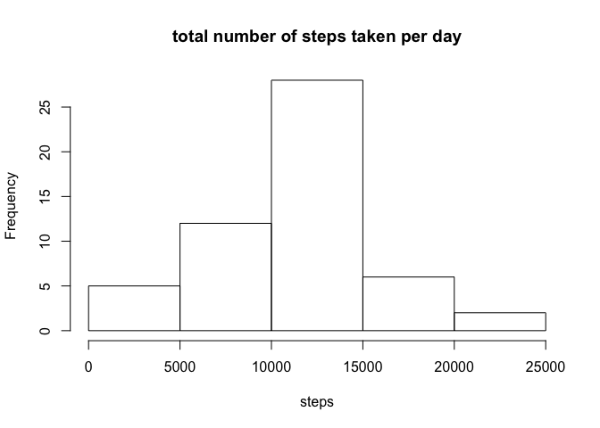
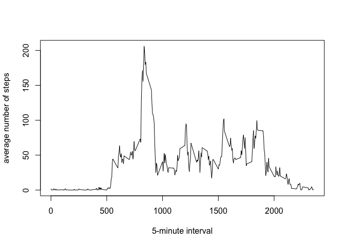
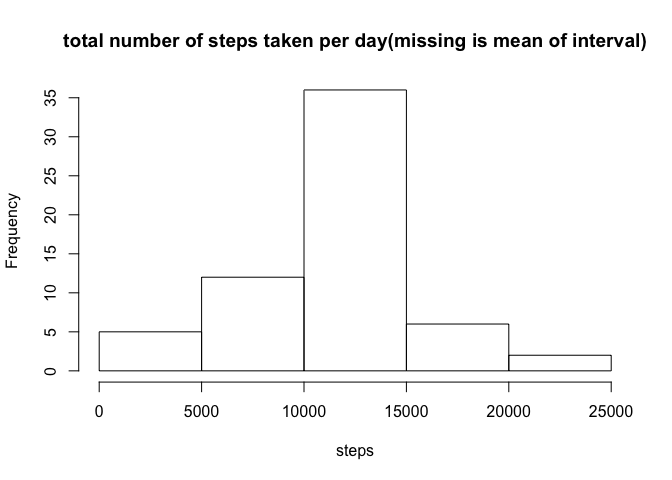
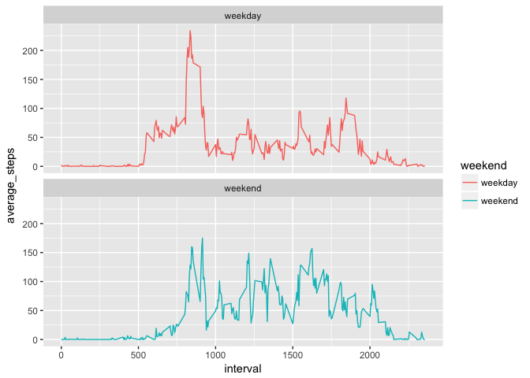

## Loading and preprocessing the data

```r
library(readr)
library(tidyverse)
```

```
## ─ Attaching packages ────────────────────────────────────── tidyverse 1.2.1 ─
```

```
## ✔ ggplot2 2.2.1     ✔ purrr   0.2.4
## ✔ tibble  1.4.2     ✔ dplyr   0.7.4
## ✔ tidyr   0.8.0     ✔ stringr 1.3.0
## ✔ ggplot2 2.2.1     ✔ forcats 0.3.0
```

```
## ─ Conflicts ──────────────────────────────────────── tidyverse_conflicts() ─
## ✖ dplyr::filter() masks stats::filter()
## ✖ dplyr::lag()    masks stats::lag()
```

```r
activity <- read_csv("activity.csv")
```

```
## Parsed with column specification:
## cols(
##   steps = col_integer(),
##   date = col_date(format = ""),
##   interval = col_integer()
## )
```

```r
#View(activity)
```
  
  
## What is mean total number of steps taken per day?
  
1.Calculate the total number of steps taken per day

```r
activity %>% group_by(date) %>% summarise_at(vars(steps), sum) -> steps_perday
print(steps_perday)
```

```
## # A tibble: 61 x 2
##    date       steps
##    <date>     <int>
##  1 2012-10-01    NA
##  2 2012-10-02   126
##  3 2012-10-03 11352
##  4 2012-10-04 12116
##  5 2012-10-05 13294
##  6 2012-10-06 15420
##  7 2012-10-07 11015
##  8 2012-10-08    NA
##  9 2012-10-09 12811
## 10 2012-10-10  9900
## # ... with 51 more rows
```
  
  
2.If you do not understand the difference between a histogram and a barplot, research the difference between them. Make a histogram of the total number of steps taken each day

```r
hist(steps_perday$steps, xlab = "steps", main = "total number of steps taken per day")
```

<!-- -->
  
  
3.Calculate and report the mean and median of the total number of steps taken per day
  
mean

```r
steps_perday$steps %>% mean(na.rm = TRUE)
```

```
## [1] 10766.19
```
median

```r
steps_perday$steps %>% median(na.rm = TRUE)
```

```
## [1] 10765
```


## What is the average daily activity pattern?
  
1.Make a time series plot (i.e. type = "l") of the 5-minute interval (x-axis) and the average number of steps taken, averaged across all days (y-axis)


```r
activity %>% 
  group_by(interval) %>%
  summarise(average_stps = mean(steps, na.rm =TRUE)) -> Av_Steps_In
print(Av_Steps_In)
```

```
## # A tibble: 288 x 2
##    interval average_stps
##       <int>        <dbl>
##  1        0       1.72  
##  2        5       0.340 
##  3       10       0.132 
##  4       15       0.151 
##  5       20       0.0755
##  6       25       2.09  
##  7       30       0.528 
##  8       35       0.868 
##  9       40       0.    
## 10       45       1.47  
## # ... with 278 more rows
```


```r
plot(Av_Steps_In$interval, Av_Steps_In$average_stps, 
     type = "l", 
     xlab = "5-minute interval",
     ylab = "average number of steps")
```

<!-- -->
  
2.Which 5-minute interval, on average across all the days in the dataset, contains the maximum number of steps?

```r
Av_Steps_In %>% arrange(desc(average_stps))
```

```
## # A tibble: 288 x 2
##    interval average_stps
##       <int>        <dbl>
##  1      835         206.
##  2      840         196.
##  3      850         183.
##  4      845         180.
##  5      830         177.
##  6      820         171.
##  7      855         167.
##  8      815         158.
##  9      825         155.
## 10      900         143.
## # ... with 278 more rows
```
  
The anser is 835.
  
  
## Imputing missing values
  
1.    Calculate and report the total number of missing values in the dataset (i.e. the total number of rows with NAs)


```r
activity$steps %>% is.na() %>% table()
```

```
## .
## FALSE  TRUE 
## 15264  2304
```
  
The anser is 2,304
  
  
2.    Devise a strategy for filling in all of the missing values in the dataset. The strategy does not need to be sophisticated. For example, you could use the mean/median for that day, or the mean for that 5-minute interval, etc.
  
I use the mean for that 5-minute interval.


3.    Create a new dataset that is equal to the original dataset but with the missing data filled in.

activity2 is new dataset.


```r
activity2 <- activity

a <- which(activity2$steps %>% is.na())

for(i in 1:length(a)){
  
  l <- a[i]
  
  activity2[l, "interval"] %>% as.numeric() -> b
  
  activity2[l, "steps"] <-  Av_Steps_In %>%
    filter(interval == b) %>% 
    select(average_stps) %>% 
    as.numeric()

}
```

4.    Make a histogram of the total number of steps taken each day and Calculate and report the mean and median total number of steps taken per day. Do these values differ from the estimates from the first part of the assignment? What is the impact of imputing missing data on the estimates of the total daily number of steps?


```r
activity2 %>% group_by(date) %>% summarise_at(vars(steps), sum) -> steps_perday2
hist(steps_perday2$steps, xlab = "steps", main = "total number of steps taken per day(missing is mean of interval)")
```

<!-- -->


```r
#no imputing
hist(steps_perday$steps, xlab = "steps", main = "total number of steps taken per day")
```

<!-- -->


## Are there differences in activity patterns between weekdays and weekends?

1.    Create a new factor variable in the dataset with two levels – “weekday” and “weekend” indicating whether a given date is a weekday or weekend day.


```r
library(lubridate)
```

```
## 
## Attaching package: 'lubridate'
```

```
## The following object is masked from 'package:base':
## 
##     date
```

```r
activity$weekday <- activity$date %>% wday(label = TRUE, locale = "en_US") 
```


```r
week_d <- 
  function(x){
  if(x == "Sun" | x =="Sat"){"weekend"}
  else{"weekday"}
}

activity$weekend <- sapply(activity$weekday, FUN =week_d)

#check
#activity %>% View()
```


2.    Make a panel plot containing a time series plot (i.e. type = "l") of the 5-minute interval (x-axis) and the average number of steps taken, averaged across all weekday days or weekend days (y-axis). See the README file in the GitHub repository to see an example of what this plot should look like using simulated data.


```r
activity %>% 
  group_by(interval, weekend) %>% 
  summarise(average_steps =  mean(steps, na.rm = TRUE)) -> Iv_Wd
Iv_Wd
```

```
## # A tibble: 576 x 3
## # Groups:   interval [?]
##    interval weekend average_steps
##       <int> <chr>           <dbl>
##  1        0 weekday         2.33 
##  2        0 weekend         0.   
##  3        5 weekday         0.462
##  4        5 weekend         0.   
##  5       10 weekday         0.179
##  6       10 weekend         0.   
##  7       15 weekday         0.205
##  8       15 weekend         0.   
##  9       20 weekday         0.103
## 10       20 weekend         0.   
## # ... with 566 more rows
```


```r
ggplot(Iv_Wd, aes(x = interval, y = average_steps), xlab = "5-minute interval", ylab = "") +
  geom_line(aes(colour = weekend) , size = 0.5)+
  facet_wrap(~ weekend, nrow = 2)
```

<!-- -->


